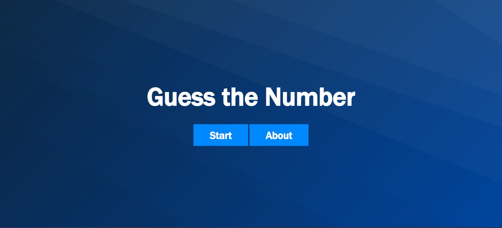
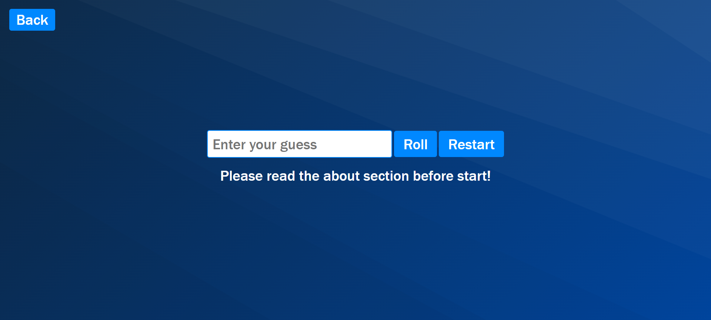

# Guess the Number Game

## Screenshots

### 1. Game Start Screen

### 2. Game Play Screen

### 3. Game About Screen

## Introduction
"Guess the Number" is a fun and interactive web-based game where the player tries to guess a randomly generated number within a specified range. The game gets progressively harder as the player advances through levels, with each level increasing the range of possible numbers.

## How to Play
1. **Start the Game**: Click the "Start Game" button to begin.
2. **Read the About Section**: It is recommended to read the about section before starting the game to understand the rules and game mechanics.
3. **Guessing**:
    - Enter your guess in the input field and click "Roll" to submit your guess.
    - The game will give you hints to either increase or decrease your guess based on the randomly generated number.
4. **Winning the Level**:
    - If you guess the correct number, you move on to the next level.
    - The range of numbers increases with each level, making the game more challenging.
5. **Completing the Game**:
    - The game consists of 6 levels. If you complete all the levels, you win the game!
6. **Restart**:
    - Click "Restart" to start the game again from Level 1.

## Features
- **Multiple Levels**: Each level has an increasing range of numbers, making the game more challenging as you progress.
- **Dynamic Feedback**: The game provides real-time feedback on whether to guess higher or lower.
- **Animations**: Enjoy smooth text animations that enhance the user experience.
- **About Section**: Detailed instructions and rules are provided to help new players get started.

## Game Logic
1. The game starts at Level 1 with a number range from 1 to 100.
2. For each correct guess, the level increases and the maximum number is increased by 25.
3. Players are prompted to guess a number within the specified range.
4. If the guess is incorrect, a hint is displayed to either increase or decrease the guessed value.
5. The game ends when the player completes Level 6 or clicks the restart button.

## Code Structure
- **HTML Files**:
  - `Start.html`: Contains the start screen with buttons to start the game or view the about section.
  - `Game.html`: Contains the main game interface where the player guesses the number.
  - `about.html`: Provides information about the game rules and instructions.
- **JavaScript File (`index.js`)**:
  - Handles the game logic, including generating random numbers, validating input, updating levels, and providing feedback to the player.
  - Includes functions for text animations and managing game state.

## Installation & Setup
1. Download or clone the repository to your local machine.
2. Open `Start.html` in your browser to start the game.

## Technologies Used
- **HTML**: Structure of the game pages.
- **CSS**: Styling and animations for a better user experience.
- **JavaScript**: Core game logic, user interactions, and DOM manipulations.
